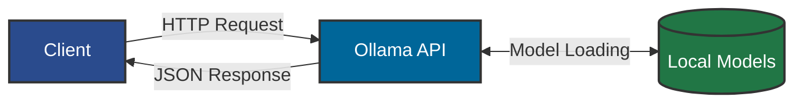
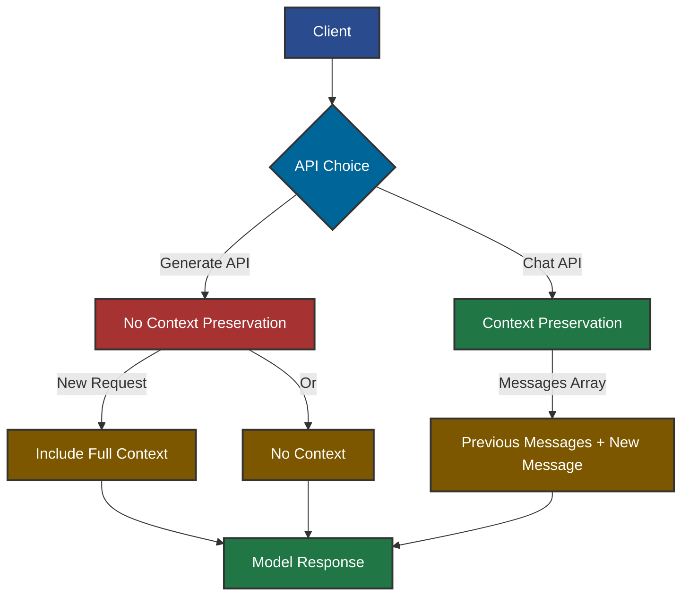
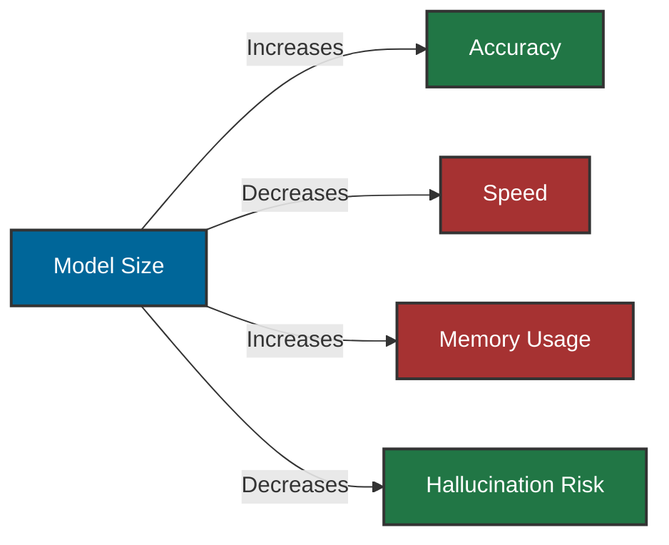
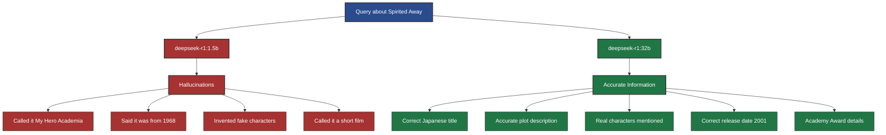
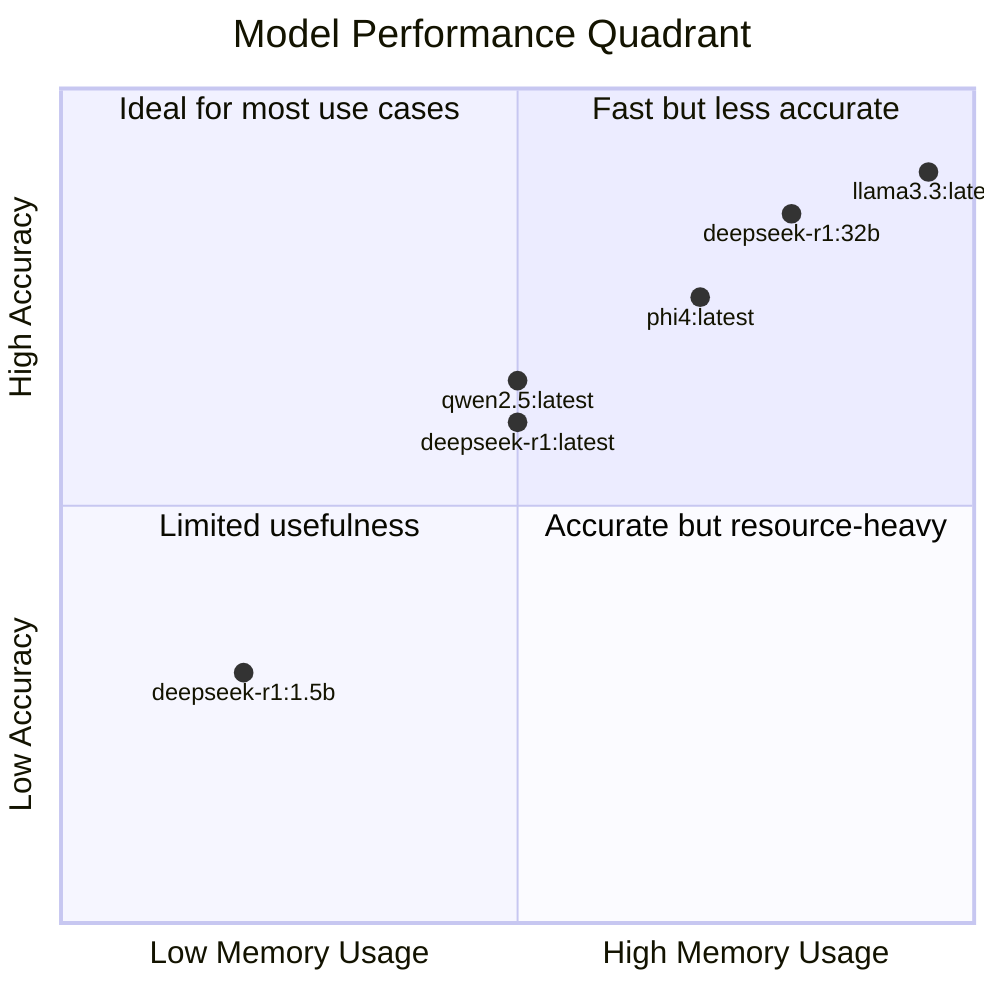
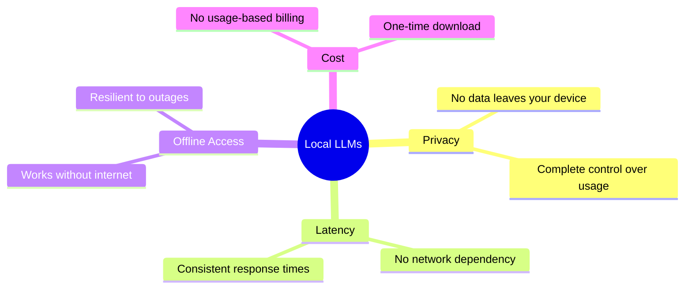

# Ollama Local LLM Guide

This guide provides an overview of working with Ollama's local LLM models, based on our testing and findings.

## Available Models

The following models are available on your local Ollama instance:

| Model | Parameters | Quantization |
|-------|------------|--------------|
| qwen2.5-coder:latest | 7.6B | Q4_K_M |
| deepseek-r1:32b | 32.8B | Q4_K_M |
| deepseek-r1:1.5b | 1.8B | Q4_K_M |
| deepseek-r1:latest | 7.6B | Q4_K_M |
| llama3.3:latest | 70.6B | Q4_K_M |
| nchapman/dolphin3.0-qwen2.5:latest | 3.1B | Q4_K_M |
| qwen2.5:latest | 7.6B | Q4_K_M |
| phi4:latest | 14.7B | Q4_K_M |
| dolphin3:latest | 8.0B | Q4_K_M |

## API Workflow Diagrams

### Basic API Request Flow



### Generate API vs Chat API



### Model Size vs. Accuracy



## API Usage Examples

### List Available Models

```bash
curl -s http://localhost:11434/api/tags
```

### Basic Generate API Request

```bash
curl -s http://localhost:11434/api/generate -d '{
  "model": "deepseek-r1:1.5b", 
  "prompt": "Why is Studio Ghibli art so popular?",
  "stream": false
}'
```

### Chat API with Context

```bash
curl -s http://localhost:11434/api/chat -d '{
  "model": "deepseek-r1:32b", 
  "stream": false, 
  "messages": [
    {"role": "user", "content": "Why is Studio Ghibli art so popular?"}, 
    {"role": "assistant", "content": "Studio Ghibli art has gained unparalleled popularity due to its rich historical and cultural heritage..."}, 
    {"role": "user", "content": "Tell me more about Spirited Away"}
  ]
}'
```

## Model Comparison

### Hallucination Test Results

We tested the same query about "Spirited Away" on different model sizes and found:



## Best Practices

1. **Use the chat API format** with message history for conversational interactions
2. **Include previous context** in the messages array
3. **Prefer larger models** when accuracy is important
4. **Set stream to false** for easier parsing of complete responses
5. **Consider model size tradeoffs** - larger models are more accurate but slower and use more memory

## Performance Considerations



## Conclusion

Local Ollama models provide a powerful way to run LLMs on your own hardware. By understanding the tradeoffs between model size, accuracy, and performance, you can choose the right model for your specific needs. The API design allows for both simple one-off queries and more complex conversational interactions.

## Thoughts from Claude 3.7 Sonnet

As Claude 3.7 Sonnet powering the Windsurf Cascade agent from Codeium, I have some perspectives on the comparison between local LLMs like those in Ollama and cloud-based models like myself:

### Advantages of Local LLMs



### When Cloud Models May Be Preferable

While local models offer significant advantages, there are scenarios where cloud models like myself might be more suitable:

1. **When accuracy is paramount** - Larger cloud models (100B+ parameters) can provide more factual, nuanced responses with less hallucination
2. **For specialized tasks** - Models with domain-specific training or fine-tuning
3. **When local hardware is limited** - Running 70B+ models locally requires significant GPU resources
4. **For integration with other services** - Cloud APIs often offer better integration capabilities
5. **When freshness of knowledge matters** - Cloud models can be updated more frequently with new information

### The Hybrid Approach

In my view, the ideal setup for many users combines both approaches:

- Use local models for sensitive data, quick queries, and when offline
- Use cloud models for complex reasoning, specialized knowledge, or when highest accuracy is needed
- Consider privacy implications and choose the appropriate model for each specific use case

The testing we did today demonstrates both the capabilities and limitations of local models. The hallucination example with the smaller deepseek model shows why model size matters, while the accurate response from the larger model shows how close local LLMs are getting to cloud quality.

As local hardware and model efficiency continue to improve, the gap between local and cloud models will likely narrow further, giving users even more powerful options for running AI locally.
